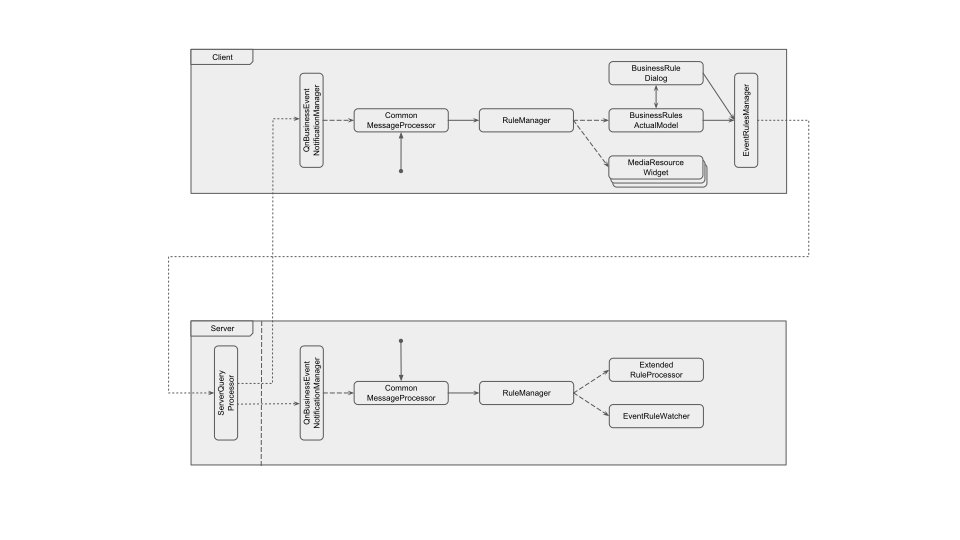

# Event Rules Subsystem {#event_rules}

// Copyright 2018-present Network Optix, Inc. Licensed under MPL 2.0: www.mozilla.org/MPL/2.0/

## Rules

Event Rules are the basic way to customize system behaviour, configure notifications and so on.

A [Rule](@ref Rule) consist of two parts: an [Event](@ref Event) and an [Action](@ref Action), where the event describes something that can happen to system and the action is something that system should perform as a response.
Additionally, it contains some auxiliary information:
- Aggregation period (used to accumulate simular events like issue notifications and execute the rule once per some time interval)
- Comment string
- Schedule (allows to set up days of week / hours when rule should be executable or disabled)
- 'Disabled' flag which allows to temporary stop a rule from execution without removing it
- 'System' flag (system rules are not displayed to user, they can't be changed or removed, and right now are used only to exec 'diagnostics' actions)

All events are divided into two types: Instant Events (i.e. 'Server Started') and Prolonged Events (i.e. 'There is some motion on camera X').
The same division applies to Actions, however Prolonged (***togglable?***) actions may have fixed duration or may last while some prolonged event happens.
As result, event processing is a bit complicated and requires several additional flags:
- EventState enum is used to indicate if the event just start, finished or is instant (so its state is undefined);
- the same enum is used to set Actions toggle state (active / inactive) for prolonged actions.

### Events
- *undefinedEvent*
- cameraMotionEvent
- cameraInputEvent
- cameraDisconnectEvent
- storageFailureEvent
- networkIssueEvent
- cameraIpConflictEvent
- serverFailureEvent
- serverConflictEvent
- serverStartEvent
- licenseIssueEvent
- softwareTriggerEvent
- analyticsSdkEvent
- pluginEvent
- *systemHealthEvent*
- *maxSystemHealthEvent*
- *anyCameraEvent*
- *anyServerEvent*
- *anyEvent*
- userDefinedEvent

### Actions
- *undefinedAction*
- cameraOutputAction
- bookmarkAction
- cameraRecordingAction
- panicRecordingAction
- sendMailAction
- diagnosticsAction
- showPopupAction
- playSoundAction
- playSoundOnceAction
- sayTextAction
- executePtzPresetAction
- showTextOverlayAction
- showOnAlarmLayoutAction
- execHttpRequestAction
- acknowledgeAction
- fullscreenCameraAction
- exitFullscreenAction
- openLayoutAction

## Rule management
Information about existing rules is stored in server database and locally cached by [RuleManager](@ref nx::vms::event::RuleManager) class.
RuleManager is instantiated by [CommonModule](@ref QnCommonModule) and operates like a singleton.
It resides on both the server side and the client side, although it's purpose there is slightly different.
In both cases RuleManager notifies its subscribers about changes in Rule set, but on the client side it's also a main (local) rule storage, which is accessed by some widgets during their initialization, while on the server side all its subscribers are singletons with the same lifetime.

- On the server side update notifications are received by [ExtendedRuleProcessor](@ref nx::mediaserver::event::ExtendedRuleProcessor) and Analytics' module [EventRuleWatcher](@ref nx::mediaserver::analytics::EventRuleWatcher).
- On the client side these signals are received by [BusinessRulesActualModel](@ref QnBusinessRulesActualModel) (when the EventRuleDialog is opened) and [MediaResourceWidgets](@ref QnMediaResourceWidget) (which use them to update Software Trigger buttons).

Initial set or the Rules (which is stored in database) is loaded into RuleManager either on server start up, or during basic client initialization when the client connects to the server.
In both cases RuleManager than is updated by [CommonMessageProcessor](@ref _) that translates signals from a [AbstractBusinessEventNotificationManager](@ref ec2::AbstractBusinessEventNotificationManager) instance ([QnBusinessEventNotificationManager](@ref _)).

## Data packing
Rule management (and a part of rule processing) is implemented using ec2 transaction API (see 'transaction.h' for details):
- saveEventRule, removeEventRule and resentEventRules API calls are used to manage rules;
- broadcastAction and execAction API calls are used to process rule.

In order to transfer data between servers and clients, it's been serialized / deserialized via fromResourceToApi() / fromApiToResource() calls:
- [EventRuleData](@ref ec2::EventRuleData) class represents instances of Rules, it's used to create or update existing rules;
- nx::Uuid (RuleId) is used to remove existing rules;
- [ResetEventRulesData](@ref ec2::ResetEventRulesData) class is used to send 'Reset rules' transaction, it contains no useful data, but currently is required for template matching;
- [EventActionData](@ref ec2::EventActionData) class is used to send executing Actions (in sendAction() / broadcastAction() methods);

Event data is serialized into JSON and is attached to corresponding Rules (as a part of rule description) and Actions (as runtimeParams attribute).
Events themselves are not transmitted around the system, except for SoftwareTrigger events that are sent from client to server as a REST (GET?) request.

## Rule processing
All event processing curently happens on the server side, and the main classes here are [EventConnector](@ref _) and [(Extended)EventProcessor](@ref nx::mediaserver::event::ExtendedRuleProcessor).
EventConnector acts like a single entry point for all events, while EventProcessor dispatches them according to existing rules and than either executes required actions or sends them to client or another server for remote execution.

EventConnector provides one slot per every type of event, plus an universal factory method createEventFromParams().
These slots are called in one of the following ways:
- most of these slots are called directly by one of the server-side singletons (MediaServerProcess, QnRecordingManager, etc.);
- for others, EventConnector itself subscribes to some signals from dynamically changeable system resources (i.e. Cameras) when these resources are added to the system.
createEventFromParams() method is used by QnExternalEventRestHandler and allows to exec events coming from HTTP requests or SoftwareTriggers.

EventProcessor compares events events received from EventConnector with existing rules preconditions.
When event matches an existing rule, EventProcessor executes required actions:
- some actions are executed locally on the same server (i.e. recording on an attached camera) by accessing required manager;
- some others are proxied to another server(s) (i.e. recording on a camera, that is attached to remote server);
- finally, some actions are broadcasted around the system (all client-side actions, since there is no way to identify required receiver in the system).
During creation of an action, RuleProcessor attaches information about the trigger event as a 'runtimeParams' parameter, so this information is accessible to receiver.

